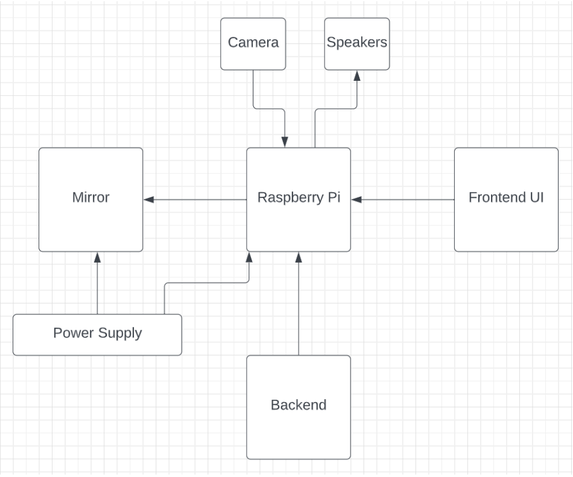

## Merror

Did you know that the average person spends 30-60 minutes everyday looking at a mirror? Me and my team wanted to create a custom experience as you look into the mirror each morning. Merror (Me&Mirror) is a smart mirror that was made though a raspbeery Pi that used open openCV's vision face recognition library to provide a tailored smart mirror experience. It included a UI that allowed you to check your calendar and look at emails all as you check yourself out in the morning.

[Full Report](https://drive.google.com/file/d/1kLCtPJQI25DSA268RUAyO7kjYhL2Uo3V/view?usp=sharing)