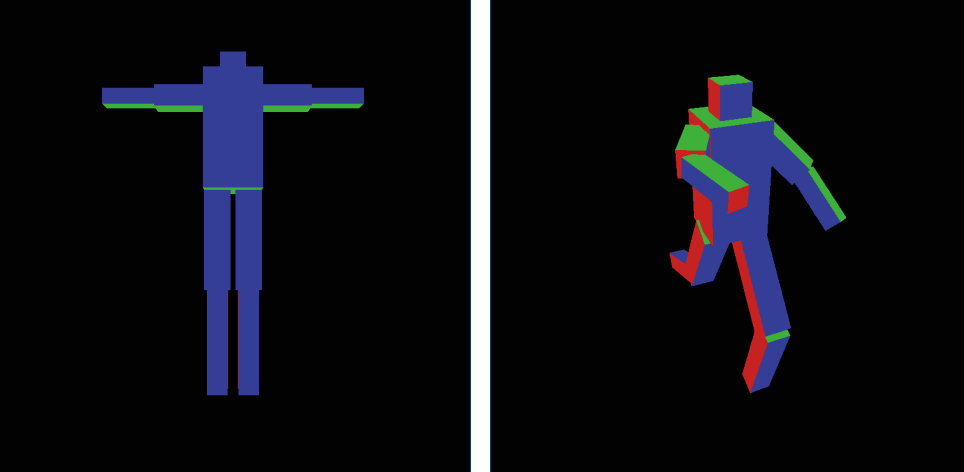
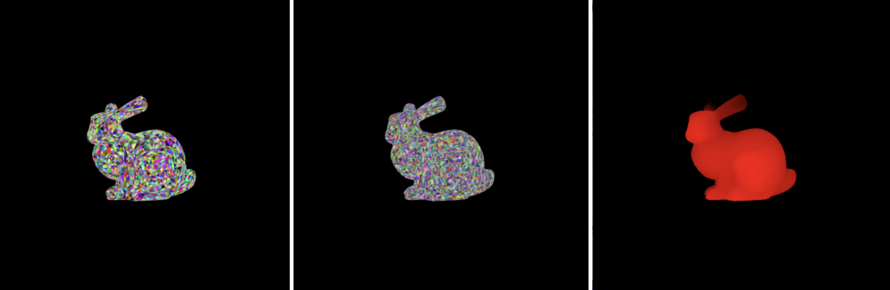
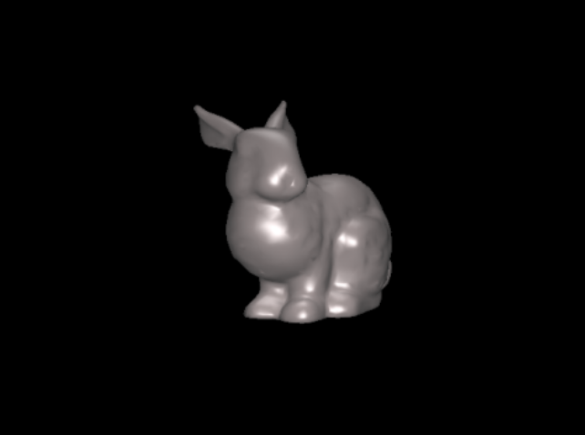
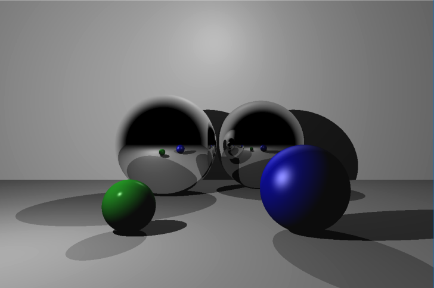
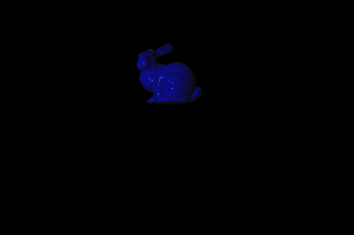

# Graphics Class
This is the graphics experience I have from my graphics class and the various projects we did, for the end project we created a Ray Tracer using OpenGL's graphics library to render our objects.

# Robot

Hierarchical modeling and camera controls to create a robot (essentially a series of moving boxes).

# Rasterizing

Rasterizing triangles to render the triangles on this bunny according to their respective depth from the camera.

# Shading Approaches

Shading using Gouraud approach.

Phong shading model as well as a silhouette shader.

# Ray Tracing

Ray tracing for spherical objects.

Ray tracing a bunny using triangles.