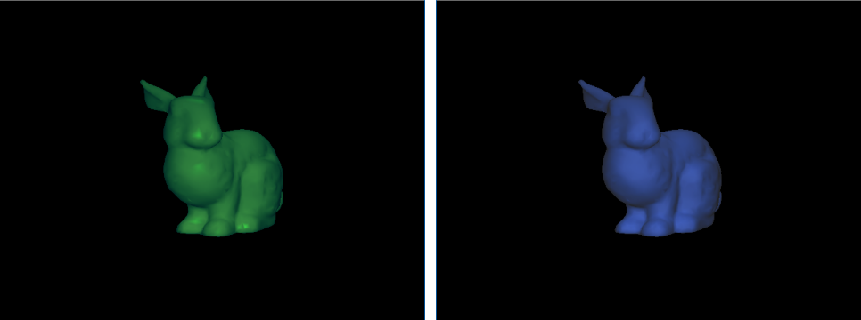

# Graphics Class
I dont know how to show proof... did we have videos? or just
In my computer graphics class one of our final projects we did was creating a ray tracer using the open computer graphics library.

# Robot

Hierarchical modeling and camera controls to create a robot (essentially a series of moving boxes).

# Rasterizing

Rasterizing triangles to shade this bunny in three different ways.

# Shading Approaches

Phong shading model using Gouraud approach.

Phong shading model using Gouraud approach and a silhouette shader.

# Ray Tracing

Ray tracing for spherical objects.

Ray tracing a bunny using triangles.