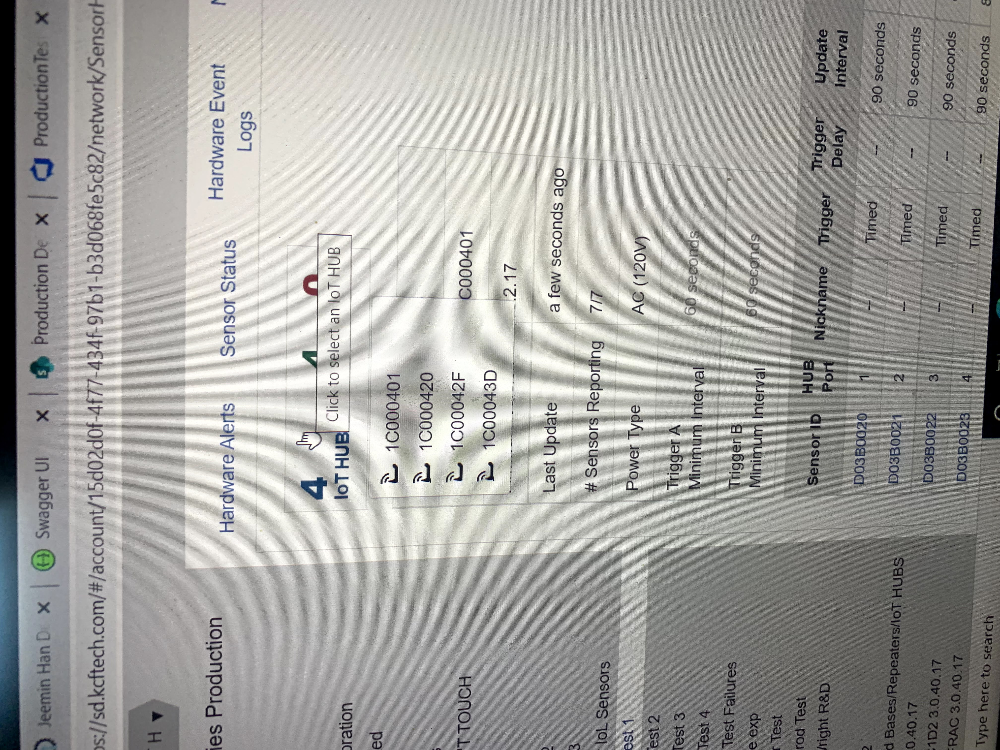

## Sensor Testing Austomation Program

During my 3 month internship at KCF Technologies I designed and created a program script using Python to automate testing of these vibration sensors.

This is the testing software where I used the company's API to interface and created a script to automate much of their testing process.

<iframe width="560" height="315" src="https://www.youtube.com/embed/FjnoF1vP2hI?si=iJ5r1-wUUbRucqwC" title="YouTube video player" frameborder="0" allow="accelerometer; autoplay; clipboard-write; encrypted-media; gyroscope; picture-in-picture; web-share" referrerpolicy="strict-origin-when-cross-origin" allowfullscreen></iframe>

After presenting my project there was a lot of good feedback, and after the internship ended I had the opportunity to get a return offer and continue working while I was in school. 

> "ALWAYS important to include the end user in the scoping and design of a tool. Great job working cross-functionally!"
> 
>  "I've used this script 30+ times today."
> 
>  "No joke, this is a total game changer."
>
> This is really nice! Great work prioritizing the important aspects of the problem!

