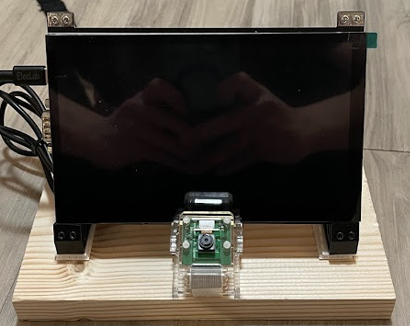
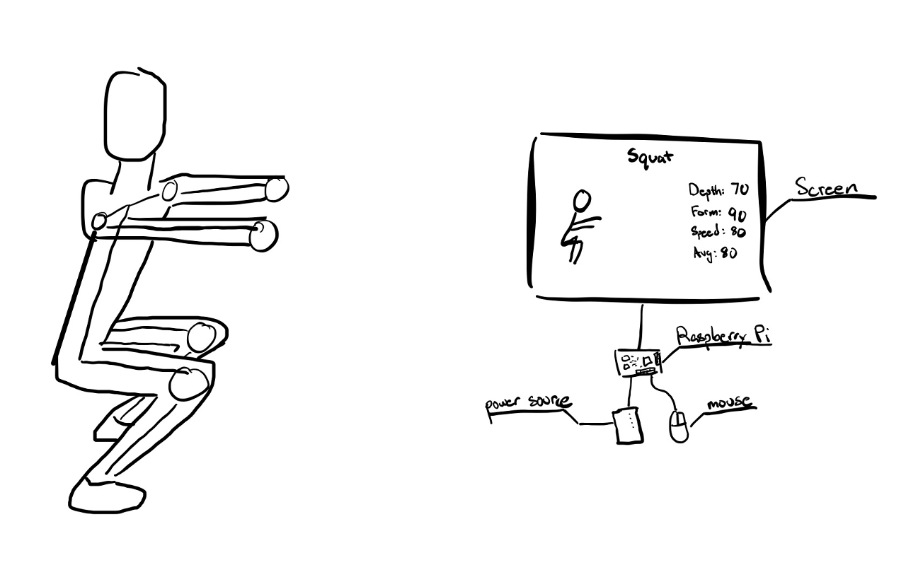

# Workout Buddy

I like to use the gym but sometimes I'm unsure of whether my form is correct. Bad form can lead to injuries and may not workout the part that you intended to. Workout buddy is a squat and pushup tracker created using a raspberry Pi and openCV's vision library. The end project included a UI system to track your workouts and get help with your form while working out.

## Additional Presentations and Documents
[PDF Full Report](https://drive.google.com/file/d/1kKqB6mGcjvgitG0Q8Sbn1KODpxHzu8GM/view?usp=sharing)

